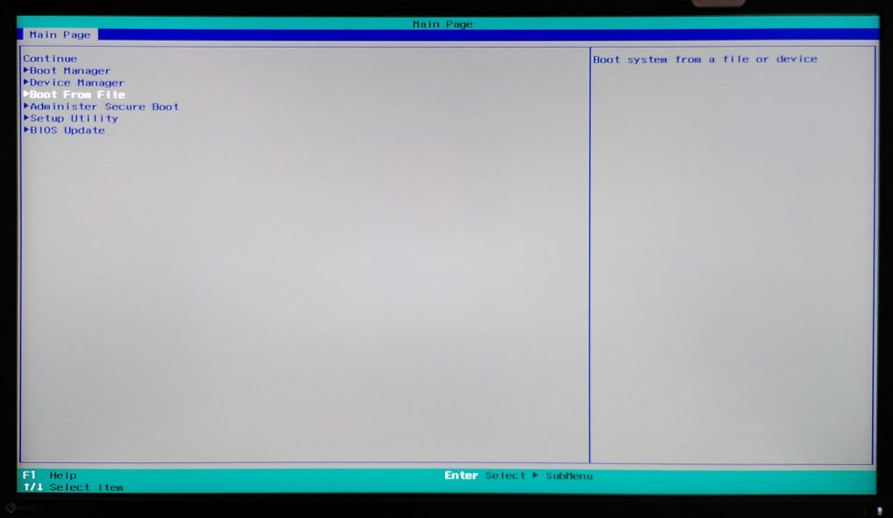
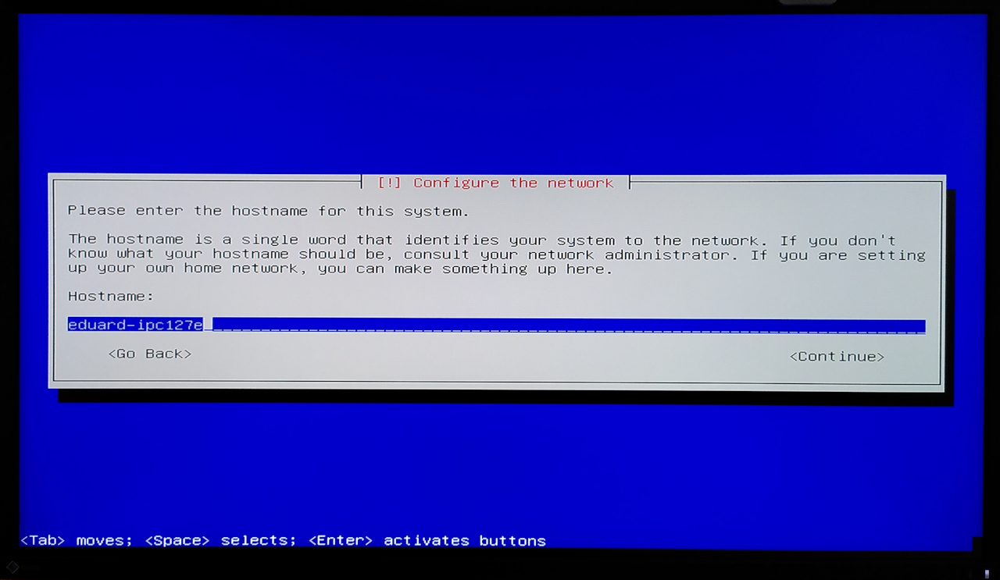
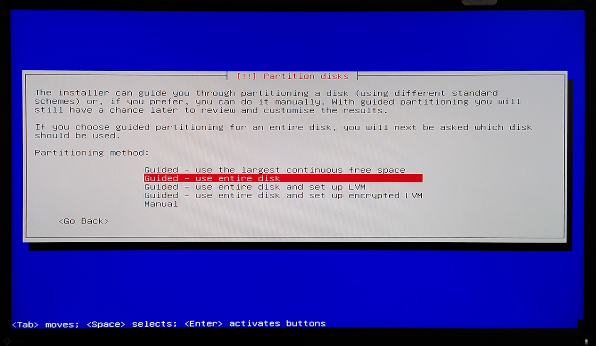

# First Time Setup of IPC127e

> **Note**: In principle, the installation method should work on any IPC. However, we have only been able to test it on the 127e so far.

## Install SIMATIC Industrial OS

It is considered the official ["SIMATIC Industrial OS"](https://sieportal.siemens.com/en-de/search?scope=catalog&Type=products&SearchTerm=SIMATIC%20Industrial%20OS%20V3.4.2&CatalogSearchSettings.Limit=20&CatalogSearchSettings.Index=0&SortingOption=Relevance) provided by Siemens will be used for the IPC127e. If this is not the case there is no guarantee that the instructions below will work as expected.

To install the OS a USB flash drive (minimum 8GB) is required. Two ways are described below, one with Linux and one with Windows, to flash the USB flash drive.

### Flashing USB Flash Drive on Linux

> **Note**: sudo privileges are required.

First estimate the USB flash drive name on your Linux system. Connect the USB flash drive to your computer. After the device is connected execute following command:

```bash
sudo dmesg
```

This prints the kernel messages on the terminal. Only the few latest are important. It should look like following:

```bash
[11081.451472] sd 3:0:0:0: Attached scsi generic sg2 type 0
[11081.452068] sd 3:0:0:0: [sdc] 62914560 512-byte logical blocks: (32.2 GB/30.0 GiB)
```

In this case, the device name is **sdc**. So we will use this to flash the image. Execute

```bash
sudo dd if=<path to SIMATIC Industrial OS ISO file> of=/dev/<device name like sdc> bs=4M status=progress
```

### Flashing USB Flash Drive on Windows

> **Note**: will be updated soon

### Booting Installer

When the USB flash drive is ready, it can be used to install the Industrial OS. To do this, the flash drive must be plugged into a USB socket, a keyboard and a monitor must be connected, as well as a network with Internet connection. Now power on the IPC127e and enter the BIOS.



Inside the BIOS please select "Boot From File". The connected hardware disks should be listed including the connected USB flash drive. Select it. After enter the "efi", then "boot". The file "bootx64.efi" should be listed. Please select it.


This loads the installer for the SIEMATIC Industrial OS. Now select Install. You will now be asked to select a language. Select your favorite one. In this example we will continue with "English". The country in which the robot is operated must then be selected. The next step is to select the keyboard layout to match your keyboard.

The network will now be configured. Please select the interface to where the network cable is connected. The network is then configured automatically via DHCP. Leave the domain name empty. As hostname choose a name you like, or use "eduard-ipc127e".



Now the users will be created. First the password for the "root" user must be configured. Leave the password empty. This will grant "sudo" privilege to the user, we will create next. After create the user "user" with the password "eduart". 


As next the disk partition needs to be created. First select the internal disk (usually the 64GB or 128GB disk). Then select the partition method. In our case choose "use entire disk".



After select the partition scheme "All files in one partition". Now a overview of the partition configuration is displayed.


Finish the partitioning by selecting "Finish partitioning and write changes to disk". You will ask again, select "yes".

As next step the package manager will be configured. We recommend to use one located in the country where the robot is located for faster downloading speed. If there is no proxy needed for internet access just let it empty (usually is the case). When you are asked if you like to contribute to the "popularity contest" answer as you like. This has no impact to the robot's functions.

The last step is to choose the packages to be installed. We strongly recommend that do not install the desktop environment! This speeds up booting a lot and there is usually no monitor connected where a GUI would make sense. Please select the packages as follow:


After the packages are installed, the installer will finish the installation and reboot the system.


## Configure IPC127e

> **Note**: All commands below are executed on the Robot. Either connect a monitor and keyboard to the IPC or connect via SSH.

For the SSH connection first you have to estimate the robot's IP address. Usually this cloud be found on your routers web interface. When you estimated the IP address you can connect by:

```bash
ssh user@<robot ip address>
```

### Network

The following network configuration is required to operate the robot. It is assumed that the control boards are connected to X2P1 (eno2), the Wifi access point is connected to X1P1 (eno1) and the third (if available) is used for maintenance.

The "interfaces" file must be edited for the configuration. Open the file using following command:

```bash
sudo nano /etc/network/interfaces
```

and put following into the file. Overwrite existing configuration.

```bash
# This file describes the network interfaces available on your system
# and how to activate them. For more information, see interfaces(5).

source /etc/network/interfaces.d/*

# The loopback network interface
auto lo
iface lo inet loopback

# The primary network interface
auto eno1
iface eno1 inet static
  address 192.168.2.100
  netmask 255.255.255.0
  network 192.168.2.0

auto eno2
iface eno2 inet static
  address 192.168.0.100
  netmask 255.255.255.0
  network 192.168.0.0

auto eno3
iface eno3 inet dhcp

```

Restart the networking service to make the settings become valid by following command:

```bash
sudo systemctl restart networking.service
```

Please be aware of that your SSH connection could be lost during the service restart.

### Docker Engine

Docker engine is used for executing our ROS software on the robot. Therefor the engine has to be installed. Please follow these [instructions](https://docs.docker.com/engine/install/debian/) including the [post install instructions](https://docs.docker.com/engine/install/linux-postinstall/).

> **Note:** We have also summarized the instructions here, but it could happen that they are not up to date:

1. Set up Docker's apt repository.

```bash
# Add Docker's official GPG key:
sudo apt-get update
sudo apt-get install ca-certificates curl gnupg
sudo install -m 0755 -d /etc/apt/keyrings
curl -fsSL https://download.docker.com/linux/debian/gpg | sudo gpg --dearmor -o /etc/apt/keyrings/docker.gpg
sudo chmod a+r /etc/apt/keyrings/docker.gpg

# Add the repository to Apt sources:
echo \
  "deb [arch="$(dpkg --print-architecture)" signed-by=/etc/apt/keyrings/docker.gpg] https://download.docker.com/linux/debian \
  "$(. /etc/os-release && echo "$VERSION_CODENAME")" stable" | \
  sudo tee /etc/apt/sources.list.d/docker.list > /dev/null
sudo apt-get update
```

2. Install the Docker packages.

```bash
sudo apt-get install docker-ce docker-ce-cli containerd.io docker-buildx-plugin docker-compose-plugin
```

3. Add your user to the docker group.

```bash
sudo usermod -aG docker $USER
```

4. Run the following command to activate the changes to groups:

```bash
newgrp docker
```

5. Verify that you can run docker commands without sudo:

```bash
docker run hello-world
```

### Git

Install git by following command:

```bash
sudo apt update
sudo apt install git
```


## Install ROS Control Software

### Prepare Environment

By default the used namespace for ROS topics, services and tf is 'eduard'. If multiple robots are connected to the same network, each robot must be given its own namespace in order to differentiate between the robots. In order to apply this namespace to all ROS nodes (control software) a environment variable needs to be set. The easiest way is defining it in the file '/etc/environment' by:

```bash
sudo nano /etc/environment
```

Now define the variable. Here in this example 'eduard/blue' was chosen. This namespace will respected by all EduArt's ROS nodes.

```bash
# EduArt
EDU_ROBOT_NAMESPACE=eduard/blue
```

You have to log out and log in again for the setting to take effect.

### Get Control Software and Launch it

First clone the Git repository by executing the command:

```bash
cd ~
git clone --branch main https://github.com/EduArt-Robotik/edu_robot.git
cd ~/edu_robot/docker/ipc127e
```

In this folder a docker compose file is located. It is used to launch the basic control software including joy node and a joy interpreter. Launch the software by:

```bash
docker compose up
```

The software will be registered for auto start after the robot boots up. If you want to remove it from the autostart execute following command inside the same folder:

```bash
docker compose down
```

#### Modifying Parameter of Control Software

If you want to change the default parameter go to the folder 'launch_content' by:

```bash
cd ~/edu_robot/docker/ipc127e/launch_content
```

Inside this folder two launch files and two parameter file are located. Usually it shouldn't be necessary to modify the launch files. So please let it untouched. The first parameter file ([eduard-ipc127e.yaml](../../../docker/ipc127e/launch_content/eduard-ipc127e.yaml)) defines all parameter used to robot control software (edu_robot). Here for example the kinematic could be changed or the collision avoidance could be adapted.

The second parameter file ([remote_control.yaml](../../../docker/ipc127e/launch_content/remote_control.yaml)) defines the user input interpretation. Here for example the joy stick button assignment could be changed or the maximum velocity at full throttle could be adapted.

To apply the new set parameter the software has to be relaunched. This can be done by:

```bash
cd ~/edu_robot/docker/ipc127e
docker compose down
docker compose up
```

### Get Web Joy and Launch it

There is also a web server as an alternative to controlling the game with the gamepad. This makes it possible to control the robot with a browser.

First clone the repository 'edu_docker' which contains a docker compose file for starting up the web server:

```bash
cd ~
git clone --branch main https://github.com/EduArt-Robotik/edu_docker.git
```

After go inside the 'edu_web_joy' folder and launch the application by executing following command:

```bash
cd ~/edu_docker/edu_web_joy/ipc127e
docker compose up
```

### Get RPLidar and Launch it

If your robot came with an RPLidar scanner than you can use our Docker image for controlling them. The ROS launch file was adapted in the way that the namespace is respected as in all EduArt's ROS nodes.

First clone the repository 'edu_docker' by the following command:

```bash
cd ~
git clone --branch main https://github.com/EduArt-Robotik/edu_docker.git
```

After go inside the 'rplidar' folder and launch the application by executing following command:

```bash
cd ~/edu_docker/rplidar
make install-udev-rules
docker compose up
```